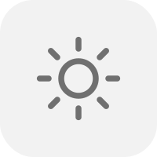
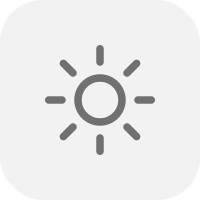
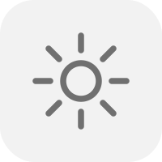

## 20 Sun SVGs for Brightness UI

A collection of **20 SVG sun icons** representing different brightness levels.
Perfect for UI sliders, apps, or custom brightness indicators.

|  |  |  |  |
|-----------------------------|-----------------------------|-----------------------------|-----------------------------|
|  |  |  |  |
|  |  |  |  |
|  |  |  |  |
|  |  |  |  |

License

MIT License – free to use, modify, and distribute.
